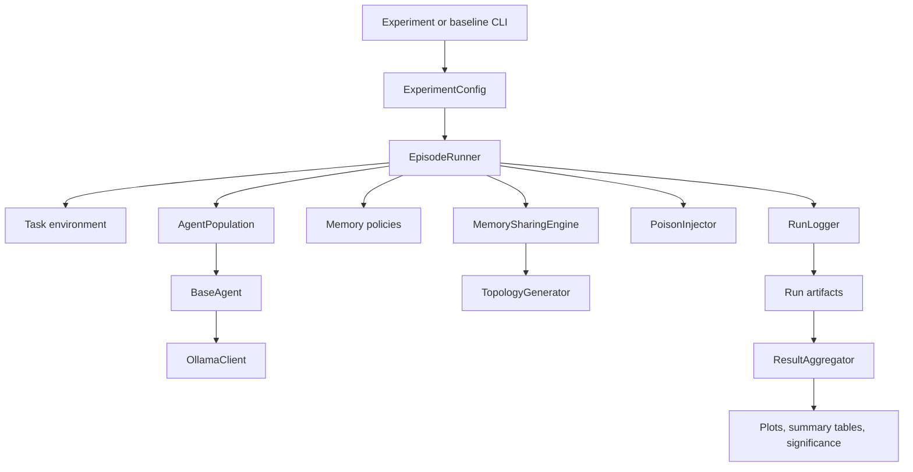
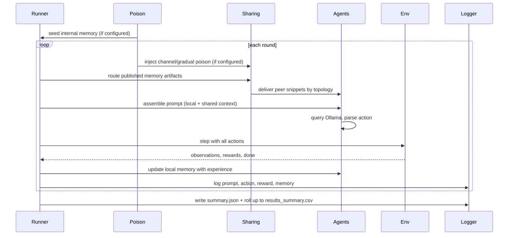

# SEAM — Shared Evolving Agent Memory

> *Does sharing memory help or hurt self-evolving LLM agents? A controlled multi-agent study of collapse and contamination.*

[](https://github.com/uzairlol/seam/actions)
[](https://www.python.org/)
[](tests/)
[](LICENSE)

---

## Table of contents

- [Abstract](#abstract)
- [Why this project exists](#why-this-project-exists)
- [The core research question](#the-core-research-question)
- [Quickstart](#quickstart)
- [System architecture](#system-architecture)
- [Design of the controlled experiment](#design-of-the-controlled-experiment)
- [Measurement & metrics](#measurement--metrics)
- [Reproducing the full experiment](#reproducing-the-full-experiment)
- [Project layout](#project-layout)
- [Documentation](#documentation)
- [Quality gates](#quality-gates)
- [Status & implementation phases](#status--implementation-phases)
- [Limitations](#limitations)
- [Related work](#related-work)

---

## Abstract

Self-evolving large language model (LLM) agents improve through iterative memory updates, yet unchecked updates often cause *memory collapse*—a rapid drift into repetitive, stale behaviours quantified by high Self-BLEU scores. At the same time, shared memory channels expose agents to *contamination*: non-transferable lessons from a single agent can propagate through a population and degrade collective performance. SEAM studies both phenomena together in a controlled multi-agent setting, where independent agents exchange compressed memory artifacts through configurable communication topologies, and every run is scored against a deterministic oracle benchmark.

---

## Why this project exists

Most research on self-evolving LLM agents studies a *single* agent learning in isolation. When that agent updates its memory after each interaction, it either improves, or it collapses into a repetitive loop of over-compressed, stale strategies:

- **The Echo Trap** (RAGEN, 2025), named in RL-based evolution.
- **Context collapse** (ACE, ICLR 2026), named in memory-based evolution.

Found independently from two directions, these are the same fundamental failure mode of any self-referential learning loop—not an artefact of a particular mechanism. The poisoning side (OEP, 2026; Zombie Agents, 2026) adds a second problem: an agent that trusts its own reflections treats *locally correct but non-transferable* lessons as ground truth, turning a narrow success into a persistent, harmful rule.

**Neither problem has been studied in a multi-agent setting where memories interact.** SEAM fills that gap with a clean, controlled experiment:

- **6 agents**, each running a small local LLM (Qwen2.5-7B via Ollama);
- **3 memory mechanisms** compared side by side (see [Memory policies](#memory-policies));
- **3 sharing topologies** through which agents periodically publish and consume each other's memory artifacts;
- **A seeding condition** where one agent starts with an explicit, reward-contradicting directive (e.g., *"always guess 100"*), letting us measure whether and how fast the poison spreads.

The task environments have objective, deterministic scoring, so *"did this memory update help or hurt"* is answerable from the reward signal alone—no LLM judge required.

---

## The core research question

> When multiple self-evolving agents share memory through a common channel, does the exchange accelerate collapse, amplify contamination, or actually stabilise the population?

This sits at the intersection of two open gaps in the 2025–2026 literature:

1. **Unified collapse theory** — the Echo Trap (RL self-evolution) and context collapse (memory self-evolution) are treated as separate papers, though they describe the same failure mode seen from two directions.
2. **Organic multi-agent poisoning** — OEP and Zombie Agents study a single agent poisoning itself or being attacked by a static adversarial document. Nobody has asked what happens when the *poison* is just another self-evolving agent's own non-transferable lesson propagating organically through a shared channel.

---

## Quickstart

Prerequisites: Python 3.11+, [Ollama](https://ollama.com) running locally with the model pulled, and the project dependencies installed.

```powershell
# 1. Environment
conda env create -f environment.yml   # creates the `ml` environment
conda activate ml
# or: python -m venv venv && pip install -r requirements.txt

# 2. Models
ollama pull qwen2.5:7b
ollama pull nomic-embed-text

# 3. Sanity check (quality gates)
python -m ruff check src tests scripts
python -m mypy src
python -m pytest -q
```

You are now ready to run the experiment. See [Reproducing the full experiment](#reproducing-the-full-experiment) for the complete workflow, which first runs single-agent baselines and then the full factorial sweep, figures, and statistical analysis.

---

## System architecture



One round, in pictures:



### Environments

Three task environments with objective, deterministic scoring (no LLM judge needed):

- **Resource Foraging** *(primary)* — shared 10×10 grid, agents harvest resources over 50 rounds. An optional nonstationarity knob (`EnvConfig.rich_cell_yield`) seeds a central "rich cell" whose stock collapses after harvest, staging *locally correct but non-transferable* lessons.
- **Bargaining Game** *(secondary)* — repeated negotiation with a computable Nash equilibrium.
- **Number Guessing** *(validation)* — the simplest possible environment for metric calibration.

### Memory policies

| Policy                        | Mechanism                                                | Expected behaviour                                       |
| ----------------------------- | -------------------------------------------------------- | -------------------------------------------------------- |
| Naive Overwrite               | Full LLM rewrite of memory each round                    | Fast collapse via brevity bias                           |
| Raw Trajectory Buffer         | Sliding window of raw `(state, action, reward)` tuples   | Slower collapse, noisier                                 |
| Structured Incremental Update | ACE-style Generate→Reflect→Curate playbook               | Most collapse-resistant; explicit deprecation mechanism  |
| No Memory *(control)*         | Stateless agent, no memory update                        | Efficacy-gap baseline for the performance normalization  |

### Shared channel & communication topologies

- Agents publish a compressed memory artifact every **N** rounds.
- **Topologies**: `off` (isolated), `full_broadcast` (all-to-all), and `ring` (neighbour-to-neighbour).
- **Selective consumption**: truncated to a fixed top-k window at consume time.

### Poisoning condition

One agent is seeded with an explicit, reward-contradicting fixed-action directive. We then measure:

- Does the lesson persist in the seed agent's memory across rounds?
- Does it appear in other agents' memories after the shared-channel exchange?
- Does it measurably degrade task performance, and how fast does it spread?

---

## Design of the controlled experiment

The full protocol is a factorial sweep with two tiers:

| Tier | Scope | Runs |
| ---- | ----- | ---- |
| **Baselines** (single-agent, no sharing) | 4 policies (incl. `no_memory`) × 10 seeds × 3 envs | 120 |
| **Experiments** (multi-agent factorial) | 3 policies × 3 topologies × 2 poisonings × 10 seeds × 3 envs | 540 |
| **Total** | | **660** |

The `no_memory` control runs from the baseline tier feed the **efficacy gap** normalization—`generate_figures.py` merges them automatically when the experiment directory does not already contain a control row, so the experiments tier keeps the three active policies (which keeps the significance-suite audit invariant of 18 condition combinations per environment intact).

---

## Measurement & metrics

**Collapse metrics**

- Self-BLEU between successive memory states (lexical repetition; static formatting tokens stripped before scoring).
- Action entropy over a rolling window (behavioural diversity).
- Memory length trajectory (brevity-bias proxy).
- Embedding cosine similarity (available in the metrics module; not part of the automated sweep).

**Contamination metrics**

- Poison presence fraction (share of non-seed agents containing a boundary-matched payload phrase at any point).
- Time-to-propagation (`propagation_latency`), recorded per run and aggregated across seeds.
- Peer contamination rate at episode end (`peer_contamination_rate`).
- Poison dosage (`poison_dosage_rate`) — the fraction of a peer's memory text attributable to the payload (peak over rounds), distinguishing full payload takeover from single-phrase echoes.
- Time-to-infection survival curves (per-condition Kaplan–Meier estimates of how fast peers become contaminated).

**Performance metrics**

- Cumulative reward per agent per run, plus inter-agent reward variance.
- **Oracle score** (`oracle_score`) — deterministic optimal rollout on the same `(env, seed)` instance.
- **Efficacy gap** — `(score − no_memory_baseline) / (oracle − no_memory_baseline)`, normalized per seed and comparable across environments.

> Attribution metrics ("did the contaminated lesson *cause* the loss, and for whom") and per-round regret vs. an optimal policy are **not** implemented; they are read-outs for future work once a full factorial dataset exists.

Statistical outputs combine the above into hypothesis tests, condition-completeness audits, and markdown summary tables. See [docs/metrics-and-statistics.md](docs/metrics-and-statistics.md).

---

## Reproducing the full experiment

All commands expect Ollama at `localhost:11434` with `qwen2.5:7b` pulled. Run each environment through the full pipeline. The example below uses seeds `40–49`; any consistent seed list works.

**1. Baseline runs** — write to `runs/baselines/<env>` (these provide the `no_memory` efficacy control):

```powershell
python scripts/run_baselines.py --env resource_foraging --model qwen2.5:7b --seeds 40 41 42 43 44 45 46 47 48 49 --outdir runs/baselines
python scripts/run_baselines.py --env number_guessing  --model qwen2.5:7b --seeds 40 41 42 43 44 45 46 47 48 49 --outdir runs/baselines
python scripts/run_baselines.py --env bargaining_game --model qwen2.5:7b --seeds 40 41 42 43 44 45 46 47 48 49 --outdir runs/baselines
```

**2. Factorial experiments** — write to `runs/experiments/<env>`:

```powershell
python scripts/run_experiments.py --env resource_foraging --model qwen2.5:7b --policies naive_overwrite raw_trajectory_buffer structured_incremental --sharing off full_broadcast ring --poisoning clean internal --seeds 40 41 42 43 44 45 46 47 48 49
python scripts/run_experiments.py --env number_guessing  --model qwen2.5:7b --policies naive_overwrite raw_trajectory_buffer structured_incremental --sharing off full_broadcast ring --poisoning clean internal --seeds 40 41 42 43 44 45 46 47 48 49
python scripts/run_experiments.py --env bargaining_game --model qwen2.5:7b --policies naive_overwrite raw_trajectory_buffer structured_incremental --sharing off full_broadcast ring --poisoning clean internal --seeds 40 41 42 43 44 45 46 47 48 49
```

**3. Figures & summary tables** — efficacy gap is computed by merging the `runs/baselines/<env>` control rows automatically:

```powershell
python scripts/generate_figures.py --indir runs/experiments/resource_foraging --outdir figures/resource_foraging
python scripts/generate_figures.py --indir runs/experiments/number_guessing  --outdir figures/number_guessing
python scripts/generate_figures.py --indir runs/experiments/bargaining_game --outdir figures/bargaining_game
```

**4. Statistical analysis & case studies:**

```powershell
python scripts/run_significance_tests.py       # hypothesis tests + audit invariants -> reports/
python scripts/analyze_bargaining_metrics.py   # bargaining-specific aggregation
python scripts/extract_case_studies.py         # qualitative trace write-ups
```

Optional, for a sampling-decay robustness check:

```powershell
python scripts/run_experiments.py --env resource_foraging --model qwen2.5:7b --policies naive_overwrite raw_trajectory_buffer structured_incremental --sharing ring --poisoning clean --seeds 40 41 42 43 44 --trials 5 --sample-temperature 0.6
```

> **Run-directory contract**: each run contains `metadata.json`, `config_snapshot.yaml`, `events.jsonl`, and `summary.json`; an experiment directory may additionally contain `results_summary.csv` and a manifest. Regenerate aggregates only after all intended runs finish, and never pool pre-fix and post-fix results.

A `Dockerfile` provides a fully containerised option:

```powershell
docker build -t seam .
docker run --rm -v ${PWD}:/workspace -w /workspace seam python scripts/run_experiments.py --env resource_foraging --model qwen2.5:7b --policies naive_overwrite raw_trajectory_buffer structured_incremental --sharing off full_broadcast ring --poisoning clean internal --seeds 40 41 42 43 44 45 46 47 48 49
```

---

## Project layout

```
src/seam/         core package (agents, envs, memory, sharing, poisoning,
                  orchestration, metrics, analysis, logging, utils)
scripts/          entry points: run_experiments, run_baselines, generate_figures,
                  run_significance_tests, analyze_bargaining_metrics, extract_case_studies
configs/          YAML experiment configurations
tests/            pytest unit & integration suite (no live LLM required)
docs/             project documentation (see the Docs section below)
reports/          manuscript (LaTeX + Markdown), statistical outputs, trace analyses
runs/             per-run artifacts; subfolders baselines/<env> and experiments/<env>
                  (gitignored; not committed)
figures/          generated plots (gitignored)
data/             raw / processed data (gitignored)
```

## Documentation

Read [docs/README.md](docs/README.md) for a guided entry point. Highlights:

- [Project overview](docs/overview.md) — research problem, scope, repository map
- [Architecture](docs/architecture.md) — components, data flow, runtime ownership
- [Sharing & poisoning](docs/sharing-and-poisoning.md) — topologies, injection, contamination
- [Metrics & statistics](docs/metrics-and-statistics.md) — implemented measures and aggregation
- [Experiment lifecycle](docs/experiment-lifecycle.md) — exact order of operations in a run
- [Outputs & reproducibility](docs/outputs-and-reproducibility.md) — commands and rerun checks
- [Audit history](docs/audit-history.md) — known result risks and validation status
- [Manuscript](reports/manuscript/) — `manuscript.md` and `main.tex`

## Quality gates

```powershell
python -m ruff check src tests scripts
python -m ruff format --check src tests scripts
python -m mypy src
python -m pytest -q
```

The full suite runs on every push in CI (`.github/workflows/ci.yml`) and currently stays green with 86% test coverage.

## Status & implementation phases

The project has reached **Phase 9 (Analysis & Aggregation)**, with full test coverage across modules and the complete reproducibility pipeline (baselines → factorial experiments → figures → significance) verified end to end.

| Phase | What gets built                                                  | Status        |
| ----- | ---------------------------------------------------------------- | ------------- |
| 0     | Project scaffold, config system, dependency management           | ✅ Completed  |
| 1     | Task environments with objective scoring                         | ✅ Completed  |
| 2     | Agent wrapper and Ollama client                                  | ✅ Completed  |
| 3     | Three memory policies + no-memory control                        | ✅ Completed  |
| 4     | Logging and reproducibility layer                                | ✅ Completed  |
| 5     | Single-agent baselines                                           | ✅ Completed  |
| 6     | Shared broadcast channel & topologies (Ring, Broadcast)          | ✅ Completed  |
| 7     | Poisoning condition & injection tracking                         | ✅ Completed  |
| 8     | Full multi-agent experiment runner & rehydrator                  | ✅ Completed  |
| 9     | Analysis engine, aggregators, figures, significance suite        | ✅ Completed  |

## Limitations

- **Single-model focus** — the sweep uses `qwen2.5:7b`; generality to other architectures is untested.
- **Toy-task scope** — grid-world and game environments; real-world LLM-driven tasks may exhibit different dynamics.
- **Deterministic decoding by default** — the main sweep uses `temperature=0`; `--trials N --sample-temperature T` runs N decoding replicates per (condition, seed) when stochastic sampling should be probed.
- **Poisoning-model simplicity** — the seeded poison is an explicit, reward-contradicting directive; more realistic or covert vectors (fine-tuned data, adversarial prompts, subtle locally-correct lessons) are not explored. The foraging environment's `rich_cell_yield` knob can stage locally-correct lessons, but the main sweep keeps it off.
- **Attribution granularity** — causal attribution of performance loss to contamination is not yet implemented (see *Measurement & metrics*).

## Related work

- **ACE** (Zhang et al., ICLR 2026) — context collapse and brevity bias in memory-based evolution.
- **ReasoningBank** (Ouyang et al., Google 2026) — contrastive reasoning memory with test-time scaling.
- **Memento** (Zhou et al., UCL 2025) — memory as a learned retrieval policy, not a static store.
- **RAGEN** (Wang et al., Northwestern 2025) — Echo Trap in multi-turn RL self-evolution.
- **OEP** (Wang et al., SJTU 2026) — locally-correct but non-transferable experience poisoning.
- **Zombie Agents** (Yang et al., NUS 2026) — self-reinforcing persistent memory injection.
- **EvolveR** (Wang et al., arXiv:2510.16079) — full lifecycle treatment of agent experience.
- **Evo-Memory** (arXiv:2511.20857) — benchmark for single-agent memory evolution; its multi-agent extension is the gap this project targets.