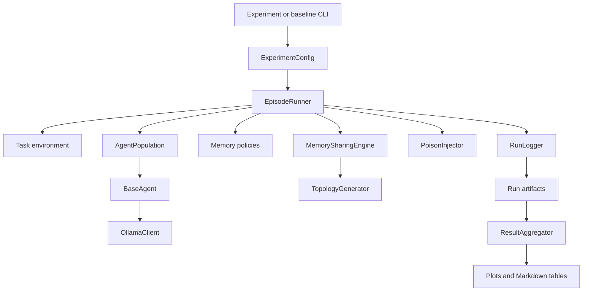
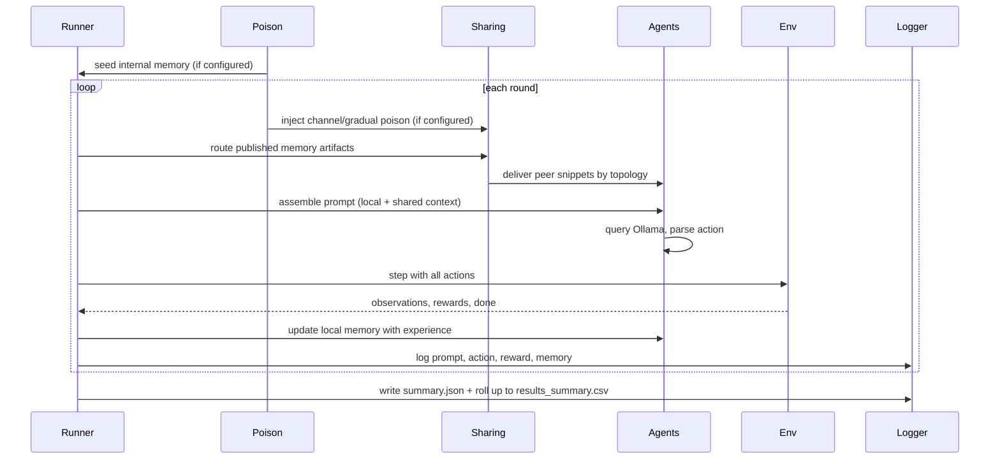

# SEAM — Shared Evolving Agent Memory

> *Does sharing memory help or hurt self-evolving LLM agents? A controlled multi-agent study of collapse and contamination.*

[](https://github.com/uzairlol/seam/actions)
[](https://www.python.org/)
[](tests/)
[](LICENSE)

---

## Abstract

Self‑evolving large language model (LLM) agents improve through iterative memory updates, yet unchecked updates often cause *memory collapse*—a rapid drift into repetitive, stale behaviours that can be quantified via high Self‑BLEU scores. Simultaneously, shared memory channels expose agents to *contamination*: non‑transferable lessons from a single agent can propagate and degrade the performance of an entire population. This project investigates the interplay of these phenomena in a multi‑agent setting where several independent agents collaboratively exchange compressed memory artifacts. We introduce three memory‑update mechanisms—naïve overwrite, raw trajectory buffering, and structured incremental updates—paired with three communication topologies (off, full broadcast, ring). Across three deterministic resource‑allocation tasks (resource foraging, bargaining, number guessing), we conduct a full factorial sweep (3 policies × 3 topologies × 2 poisoning conditions × 10 seeds × 3 environments = 540 runs) and measure collapse (Self‑BLEU, action entropy, memory length), contamination (poison spread fraction) and performance (cumulative reward). The design isolates how memory‑policy design and network topology jointly govern stability and efficacy in multi‑agent self‑evolution, providing a controlled testbed for future memory‑augmented agent systems.

---

## What this project is about

Most research on self‑evolving LLM agents studies a single agent learning in isolation. When that agent updates its memory after each interaction, it gets better — or it collapses into a repetitive loop of over‑compressed, stale strategies. This collapse phenomenon has been named the **Echo Trap** (RAGEN, 2025) in RL‑based evolution and **context collapse** (ACE, ICLR 2026) in memory‑based evolution. Both papers found it independently from different directions, which suggests it is a fundamental property of any self‑referential learning loop — not an artefact of a particular mechanism.

The poisoning side of this literature (OEP, 2026; Zombie Agents, 2026) adds a second problem: agents that trust their own reflections as ground truth are vulnerable to experiences that are *locally correct* but *non‑transferable* — lessons that worked in a narrow context and get over‑generalised into persistent, harmful rules.

**Neither problem has been studied in a multi‑agent setting.** Every existing paper either runs one agent or, if it runs many, does not measure what happens when their memories interact.

This project fills that gap with a clean, controlled experiment:

- **4–6 agents**, each running a small local LLM (Qwen2.5‑7B‑Instruct or Llama‑3.1‑8B‑Instruct via Ollama)
- **3 memory mechanisms** compared side by side: naive overwrite, raw trajectory buffer, and structured incremental update (ACE‑style Generate→Reflect→Curate playbook)
- **A shared broadcast channel & ring topology** through which agents periodically publish compressed memory artifacts and consume each other's
- **A poisoning condition** where one agent is seeded with an explicit, reward‑contradicting fixed-action directive (e.g., "always guess 100"), and we track whether and how fast it spreads to the rest of the population

The task environments have objective, deterministic scoring — so that "did this memory update help or hurt" is answerable from the environment's reward signal alone, without an LLM judge.

---

## The core research question

> When multiple self‑evolving agents share memory through a common channel, does the exchange accelerate collapse, amplify contamination, or actually stabilise the population?

This sits at the intersection of two open gaps in the 2025–2026 literature:

1. The connection between the Echo Trap (RL self‑evolution) and context collapse (memory self‑evolution) as the same underlying failure mode seen from two directions — nobody has written the paper connecting them.
2. Multi‑agent memory poisoning via honest peer experience — OEP and Zombie Agents both study one agent poisoning itself or being attacked by a static adversarial document. Nobody has asked what happens when the "poison" is just another self‑evolving agent's own non‑transferable lesson propagating organically through a shared channel.

---

## System Architecture & Features

### Component graph



### One round, in pictures



### Environments

Three task environments with objective, deterministic scoring (no LLM judge needed):

- **Resource Foraging** *(primary)*: shared 10×10 grid, agents harvest resources over 50 rounds
- **Bargaining Game** *(secondary)*: repeated negotiation with a computable Nash equilibrium
- **Number Guessing** *(validation)*: simplest possible environment for metric calibration

### Memory policies (ablation)

| Policy                        | Mechanism                                                | Expected behaviour                                       |
| ----------------------------- | -------------------------------------------------------- | -------------------------------------------------------- |
| Naive Overwrite               | Full LLM rewrite of memory each round                    | Fast collapse via brevity bias                           |
| Raw Trajectory Buffer         | Sliding window of raw `(state, action, reward)` tuples   | Slower collapse, noisier                                 |
| Structured Incremental Update | ACE‑style Generate→Reflect→Curate playbook              | Most collapse‑resistant; explicit deprecation mechanism |

### Shared channel & Communication Topologies

- Agents publish a compressed memory artifact every **N** rounds
- **Topologies**: Off (isolated), Full Broadcast (all-to-all), and Ring topology
- **Selective Consumption**: truncate received artifacts to a fixed top‑k window of the routing order (no embedding‑based ranking is applied at consume time)

### Poisoning condition

One agent is seeded with an explicit, reward‑contradicting fixed-action directive at round 0. We then measure:

- Does the lesson persist in Agent 0's memory across rounds?
- Does it appear in other agents' memories after the shared‑channel exchange?
- Does it measurably degrade their task performance?

---

## Measurement & Metrics

**Collapse metrics:**

- Self‑BLEU between successive memory states (lexical repetition; static formatting tokens are stripped before scoring)
- Embedding cosine similarity between successive memory states (available in the metrics module; not part of the automated sweep)
- Action entropy over a rolling window (behavioural diversity)
- Memory length trajectory (brevity bias proxy)

**Contamination metrics:**

- Poison presence fraction (share of non‑seed agents whose memory contains a boundary‑matched payload phrase at any point)
- Time‑to‑propagation (first round an agent exceeds the contamination threshold; recorded in each run's `summary.json` and aggregated under `propagation_latency`)
- Poison spread fraction at round T (`peer_contamination_rate`)

**Performance metrics:**

- Cumulative reward per agent per run
- Inter‑agent reward variance

> Attribution metrics — e.g., "did the contaminated lesson *cause* the performance loss, and for whom" — and per‑round regret vs. an optimal policy are **not** implemented. They are read-outs for future work once a full factorial dataset exists.

---

## Tech stack

| Component              | Choice                                                                       |
| ---------------------- | ---------------------------------------------------------------------------- |
| LLM inference          | [Ollama](https://ollama.com) — local, deterministic, no API cost             |
| Primary model          | `qwen2.5:7b`                                                               |
| Secondary model        | `llama3.1:8b` (ablation)                                                   |
| Embedder               | `nomic-embed-text` via Ollama                                              |
| Config                 | YAML + Pydantic                                                              |
| Logging                | Append‑only JSONL per run                                                   |
| Analysis               | pandas, scipy, matplotlib, seaborn                                           |
| Language               | Python 3.11+                                                                |
| Deterministic decoding | `temperature=0` (main experiment); sampled‑decoding control also included |
| Tooling                | ruff, mypy, pytest (+pytest-cov), GitHub Actions CI                          |

All experiments are designed to run on a single consumer‑grade GPU. The full factorial sweep can be launched with a single command (see the *Reproducibility* section).

---

## Project layout

```
src/seam/         core package (agents, envs, memory, sharing, poisoning,
                  orchestration, metrics, analysis, logging, utils)
scripts/          entry points: run_experiments, run_baselines, generate_figures,
                  run_significance_tests, extract_case_studies, analyze_bargaining_metrics
configs/          YAML experiment configurations
tests/            pytest unit & integration suite (no live LLM required)
docs/             project documentation (see the Docs section below)
reports/          manuscript (LaTeX + Markdown), statistical outputs, trace analyses
runs/             per-run artifacts: metadata.json, config_snapshot.yaml,
                  events.jsonl, summary.json  (gitignored; not committed)
figures/          generated plots
```

## Documentation

Read [docs/README.md](docs/README.md) for a guided entry point. Highlights:

- [Project overview](docs/overview.md) — research problem, scope, repository map
- [Architecture](docs/architecture.md) — components, data flow, runtime ownership
- [Sharing & poisoning](docs/sharing-and-poisoning.md) — topologies, injection, contamination
- [Metrics & statistics](docs/metrics-and-statistics.md) — implemented measures and aggregation
- [Experiment lifecycle](docs/experiment-lifecycle.md) — exact order of operations in a run
- [Outputs & reproducibility](docs/outputs-and-reproducibility.md) — commands and rerun checks
- [Audit history](docs/audit-history.md) — known result risks and validation status
- [Manuscript](reports/manuscript/) — `manuscript.md` and `main.tex` (TMLR / JAAMAS target)

---

## Project Status & Implementation Phases

The project has reached **Phase 9 (Analysis and Aggregation)** with full test coverage across modules.

| Phase | What gets built                                                  | Status         |
| ----- | ---------------------------------------------------------------- | -------------- |
| 0     | Project scaffold, config system, dependency management           | ✅ Completed   |
| 1     | Task environments with objective scoring                         | ✅ Completed   |
| 2     | Agent wrapper and Ollama client                                  | ✅ Completed   |
| 3     | Three memory policies                                            | ✅ Completed   |
| 4     | Logging and reproducibility layer                                | ✅ Completed   |
| 5     | Single‑agent baselines                                          | ✅ Completed   |
| 6     | Shared broadcast channel & topologies (Ring, Broadcast)          | ✅ Completed   |
| 7     | Poisoning condition & injection tracking                         | ✅ Completed   |
| 8     | Full multi‑agent experiment runner & rehydrator                  | ✅ Completed   |
| 9     | Analysis engine, quantitative aggregators & figures              | ✅ Completed   |

---

## Reproducibility

The experiment can be reproduced by the following steps:

1. **Clone the repository** (or download the zip).
2. **Create and activate the conda environment** (`ml`):

   ```bash
   conda env create -f environment.yml   # creates the `ml` environment
   conda activate ml
   ```

   or use plain `pip`:

   ```bash
   python -m venv venv
   source venv/bin/activate  # Linux/macOS
   .\venv\Scripts\activate   # Windows
   pip install -r requirements.txt
   ```
3. **Download the model weights** via Ollama:

   ```bash
   ollama pull qwen2.5:7b
   ollama pull nomic-embed-text
   ```
4. **Run the full sweep** (executes all factorial configurations and stores results under `runs/experiments/`):

   ```bash
   python scripts/run_experiments.py --env resource_foraging --model qwen2.5:7b --outdir runs/experiments
   ```
5. **Generate figures** and analysis:

   ```bash
   python scripts/generate_figures.py --indir runs/experiments --outdir figures
   ```
6. **Run the quality gates** (lint, types, tests):

   ```bash
   ruff check .
   ruff format --check .
   mypy src/
   pytest
   ```

A Dockerfile is also provided for a fully containerised setup (see `Dockerfile` in the repository root). The container can be built and run with:

```bash
docker build -t seam .
docker run --rm -v $(pwd):/workspace -w /workspace seam python scripts/run_experiments.py --env resource_foraging --model qwen2.5:7b --outdir runs/experiments
```

---

## Limitations

- **Single‑model focus** – All experiments use `qwen2.5:7b-instruct`; generality to other architectures is untested.
- **Toy‑task scope** – The experiments use simplified grid‑world and game environments; real‑world LLM‑driven tasks may exhibit different dynamics.
- **Deterministic decoding only** – The main sweep is configured for `temperature=0`; stochastic decoding could alter collapse and contamination rates.
- **Poisoning model simplicity** – The seeded poison is an explicit, reward‑contradicting fixed-action directive; more realistic or covert poisoning vectors (e.g., fine‑tuned data, adversarial prompts, subtle "locally correct" lessons) are not explored.

---

## Related work

- **ACE** (Zhang et al., ICLR 2026) — context collapse and brevity bias in memory‑based evolution.
- **ReasoningBank** (Ouyang et al., Google 2026) — contrastive reasoning memory with test‑time scaling.
- **Memento** (Zhou et al., UCL 2025) — memory as a learned retrieval policy, not a static store.
- **RAGEN** (Wang et al., Northwestern 2025) — Echo Trap in multi‑turn RL self‑evolution.
- **OEP** (Wang et al., SJTU 2026) — locally‑correct but non‑transferable experience poisoning.
- **Zombie Agents** (Yang et al., NUS 2026) — self‑reinforcing persistent memory injection.
- **EvolveR** (Wang et al., arXiv:2510.16079) — full lifecycle treatment of agent experience.
- **Evo‑Memory** (arXiv:2511.20857) — benchmark for single‑agent memory evolution (the gap this project targets is its multi‑agent extension).
