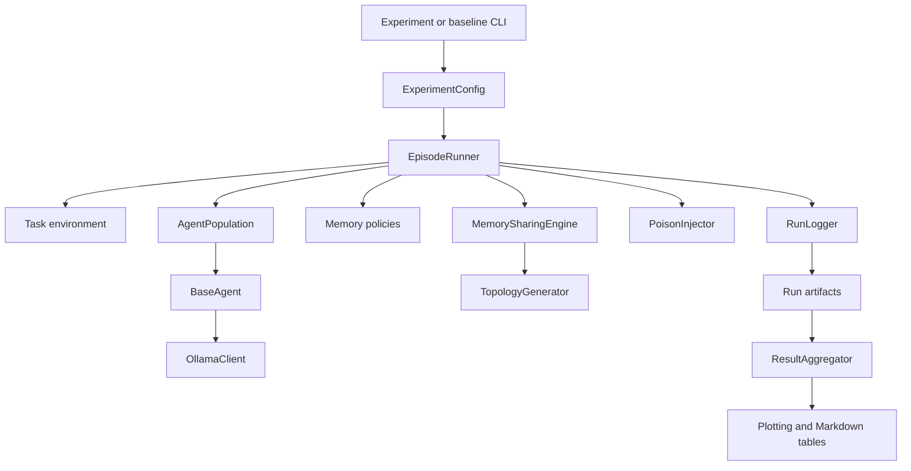

# System Architecture

## Component graph

## Runtime ownership

`EpisodeRunner` owns one environment, one population, one policy per agent, one sharing engine, one poison injector, and one run logger. The population shares a single Ollama client when one is supplied. The runner is intended to be used as a context manager so resources are released after a run.

## Main boundaries

### Agent boundary

`BaseAgent.format_prompt()` assembles system prompt, agent ID, memory context, observation, available actions, and an instruction. `BaseAgent.act()` calls Ollama and extracts an action from the response. The last assembled prompt is retained for event logging.

### Memory boundary

Every policy implements the base memory interface: reset, get context, update, serialize, and restore. The runner supplies the current experience and the shared context to update.

### Communication boundary

`MemorySharingEngine.step()` collects each policy's context, truncates the published artifact to the configured word-token proxy budget, and routes snippets using `TopologyGenerator`. The engine stores incoming snippets per agent and exposes formatted shared context.

### Environment boundary

The environment receives a dictionary of parsed actions, updates its state, and returns observations, rewards, a done flag, and diagnostic info. The runner never directly computes task rewards.

### Analysis boundary

`ResultAggregator` first prefers `results_summary.csv`; only when that file is absent does it recursively rehydrate `summary.json` files. This matters when new run folders are added without regenerating the experiment-level CSV.

## Episode data flow

1. Seed Python and NumPy and reset the environment.
2. Inject initial internal poison if configured.
3. Increment the round.
4. Inject channel/gradual poison if configured.
5. Route published memory on the sharing cadence.
6. Combine local and shared context for action prompts.
7. Collect actions from every agent.
8. Step the environment.
9. Update each local memory policy with the experience and shared context.
10. Log the prompt, response/action, reward, memory state, and environment info.
11. Repeat until the environment is done.
12. Compute summary metrics and write `summary.json`.

## Current implementation caveats

- `EpisodeRunner` accepts one seed; `ExperimentConfig.seeds` is metadata/default input, while scripts iterate seeds externally.
- The runner's event `raw_response` field currently receives the parsed action rather than the untouched model response.
- Some metrics described in project-scope documents, such as propagation latency and regret, are not currently included in runner summaries.

## Prompt and response path

For each agent and round, `BaseAgent.format_prompt()` creates a plain-text prompt. It includes the system prompt, agent ID, optional memory, the Python string representation of the observation dictionary, the first ten action-space entries, and an instruction. Bargaining observations receive role-specific instructions: proposers are asked for two integers, while responders are asked for `accept` or `reject`.

`OllamaClient.complete()` sends the prompt to `ollama.Client.generate()` with temperature, top-p, and `num_predict` taken from `ModelConfig`; an optional model seed is also passed. The client returns response text and latency. `BaseAgent.extract_action()` first checks a case-insensitive exact match, then boundary-aware textual matches, then bargaining-style numeric pairs, and finally uses a fallback action.

## Resource lifecycle

`EpisodeRunner.close()` closes the population, clears memory policies, closes the sharing engine, attempts an environment reset, and invokes garbage collection. `AgentPopulation` only closes its client when it created that client itself, so an injected shared client remains owned by the caller. This ownership distinction matters in tests and in repeated batch experiments.
