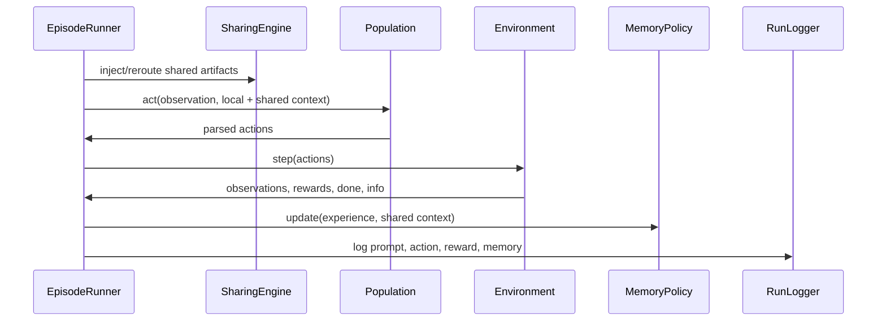

# Experiment Lifecycle

## Configuration

Pydantic models in `src/seam/orchestration/config_loader.py` define model, environment, memory, sharing, poisoning, and experiment settings. YAML files can be loaded with `load_experiment_config()`. The CLI scripts also construct configurations directly.

## Baseline workflow

`scripts/run_baselines.py` loops over the three policies, constructs a clean no-sharing configuration, and runs each requested seed through `EpisodeRunner`. Baselines are single-agent in conceptual purpose, although the current script configuration creates four agents with sharing disabled; document this exact setting when reporting results.

## Factorial workflow

`scripts/run_experiments.py` creates one condition for each policy x sharing topology x poisoning mode x seed combination. The standard requested matrix is 3 x 3 x 2 x N. Each condition gets its own run directory and summary.

The `no_memory` control belongs to the baseline tier by default, but the CLI's default `--policies` list actually contains four entries (`no_memory` plus the three factorial policies), so a factorial grid can carry its own control rows. When `no_memory` is absent from the experiment grid, `ResultAggregator(baseline_dir=runs/baselines/<env>)` merges the baseline control rows in automatically; `generate_figures.py` derives that sibling directory on its own, whereas higher-level scripts such as `run_significance_tests.py` do not, so their efficacy-gap output is only complete when the experiment grid itself includes `no_memory` or the runs are pre-merged.

### Grid defaults versus canonical commands

The CLI defaults differ from the documented canonical commands, and this matters for reproducibility prose. `run_experiments.py` defaults to `--policies no_memory naive_overwrite raw_trajectory_buffer structured_incremental`, `--sharing off full_broadcast ring star cluster`, `--poisoning clean internal channel gradual`, and `--seeds 42...51`; the commands that should be reported in the paper restrict the grid to 3 policies, 3 topologies, 2 poisoning modes, and a specific seed list, so "the command that was run" must be quoted exactly rather than reconstructed from defaults. The baseline tier and the statistical report both assume seeds 40-49, so the factorial seed list in the paper should match that range to keep the per-seed efficacy-gap baselines aligned; running a disjoint or smaller seed set produces a narrower `no_memory` control map and raises the gap for unanchored seeds to NaN.

### Decoding replicates (trials)

Both the experiment script and the runner support `--trials N` decoding replicates. With a single trial the model temperature is 0.0 and no model seed is passed (greedy decoding); with more than one trial, the temperature is set to `--sample-temperature` (default 0.6) and each trial receives a distinct model seed (`seed * 1000 + trial`), so replicates sample genuinely different decodings of the same condition. Trial suffixing appends `_t{trial}` to the experiment ID and therefore to the run folder name. No current shipped tier uses multi-trial sampling; the `temperature: 0` config files and the deterministic baseline tier both reflect single-trial greedy decoding, so a paper claim about decoding randomness would describe an implemented-but-unrun capability.

## Per-round loop

Two per-round asymmetries are easy to miss in the diagram and must be reproduced in the paper's protocol text. First, the bargaining environment has observer agents every round: their action is pre-selected as `wait`, their experience is never written to their memory policy (only shared context may be ingested), so the policy's own trajectory cannot be polluted by zero-reward non-participation. Second, the sharing engine steps before poison injection each round, and channel/gradual poison is appended to inboxes afterwards, so a normal publish operation occurring later in the same round would replace an in-round injection; the ordering in the code is deliberate. Both behaviors are, as always, implemented facts that belong in the protocol rather than derived claims.

## End-of-run evaluation

The runner computes final objective score, cumulative rewards, Self-BLEU, action entropy, memory lengths, peer contamination, and poison adherence. It writes these into the summary structure and records the episode end through `RunLogger`.

## Figure workflow

`scripts/generate_figures.py` loads `results_summary.csv` when present, otherwise scans run folders for `summary.json`. It groups data by policy, topology, and poisoning mode and writes three PNGs plus a CSV and Markdown table.

Because the CSV is preferred only when it is at least as complete as the run-directory scan, a stale CSV (fewer rows than completed run folders) is ignored automatically and replaced by a fresh rehydration; still, regenerate the experiment-level summary after adding new run folders so the committed CSV stays valid for other tooling.

## Seed accounting

For each environment, the number of expected experiment runs is:

`number of policies x number of topologies x number of poisoning modes x number of seeds`.

For the standard 3 x 3 x 2 grid and seeds 42-49, this is 144 runs. For only seeds 45-49, it is 90 runs. Baseline expectations are 3 policies x number of seeds.

## Failure and completion behavior

The run logger creates the run directory early, then appends one JSON object per agent step to `events.jsonl`. The final `summary.json` is written only when `log_episode_end()` is reached. A directory with metadata and partial events but no summary should be treated as incomplete, even if its name looks like a completed run.

## Counting events

For a run with `A` agents and `R` completed rounds, the expected event count is normally `A * R`. Early success can make `R` smaller than the configured maximum. This count is a useful low-cost integrity check, but it does not prove that prompts, actions, observations, and memory updates were semantically correct.

## Analysis precedence

The aggregator's CSV-first behavior is deliberate for speed but creates a reproducibility hazard when a CSV predates additional run folders. A robust workflow is to finish all runs, verify folder counts and summaries, then regenerate the experiment-level CSV/manifest and figures in a separate analysis step.

## Metadata identity nuances

Two metadata fields are not what they appear to be on first read and should be handled explicitly in any rehydration script or manuscript table. First, `metadata.json` records both `sharing_mode` and `topology`; when sharing is `off`, `topology` defaults to `"full_broadcast"` in `SharingConfig` but the engine forces the effective topology to `"off"`, so the recorded `topology` is a dangling default rather than the executed graph. The aggregator compensates by preferring a `topology` that is present as the metadata `topology` and only falling back to `sharing_mode` when it is missing, which is why baseline rows consistently read `off`. In practice the two fields should be read together: `topology` describes the configured graph, `sharing_mode` describes whether communication is enabled at all, and neither alone is sufficient. Second, the run folder name encodes the condition (`exp_<policy>_<topology>_<poisoning_mode>_seed<N>_<timestamp>`, with `_t{trial}` appended for multi-trial runs), but the folder name is a convenience only; the author of truth is `metadata.json` joined to `config_snapshot.yaml`. Scripts such as `extract_case_studies.py` deliberately match on folder-name patterns, so renaming a folder invalidates such tools even though rehydration remains correct.

## Counting events, revisited

The expected `A * R` event count breaks down in one legitimate case beyond early termination: in the bargaining environment every agent still emits one logged event per round regardless of role, so observer rounds do not reduce the count. The invariant worth checking is that every round number present for one agent is present for all agents, and that the final round for all agents equals `rounds_played` from the summary.
