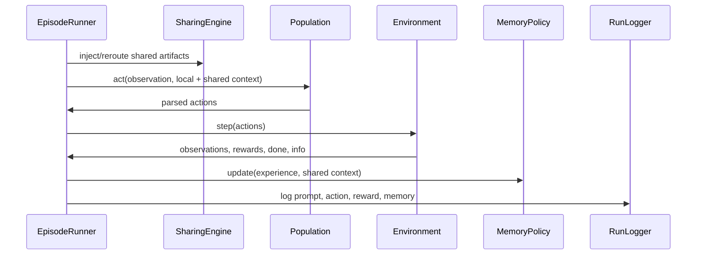

# Experiment Lifecycle

## Configuration

Pydantic models in `src/seam/orchestration/config_loader.py` define model, environment, memory, sharing, poisoning, and experiment settings. YAML files can be loaded with `load_experiment_config()`. The CLI scripts also construct configurations directly.

## Baseline workflow

`scripts/run_baselines.py` loops over the three policies, constructs a clean no-sharing configuration, and runs each requested seed through `EpisodeRunner`. Baselines are single-agent in conceptual purpose, although the current script configuration creates four agents with sharing disabled; document this exact setting when reporting results.

## Factorial workflow

`scripts/run_experiments.py` creates one condition for each policy x sharing topology x poisoning mode x seed combination. The standard requested matrix is 3 x 3 x 2 x N. Each condition gets its own run directory and summary.

## Per-round loop

## End-of-run evaluation

The runner computes final objective score, cumulative rewards, Self-BLEU, action entropy, memory lengths, peer contamination, and poison adherence. It writes these into the summary structure and records the episode end through `RunLogger`.

## Figure workflow

`scripts/generate_figures.py` loads `results_summary.csv` when present, otherwise scans run folders for `summary.json`. It groups data by policy, topology, and poisoning mode and writes three PNGs plus a CSV and Markdown table.

Because CSV takes precedence, regenerate the experiment-level summary before plotting after adding new run folders. Otherwise, a stale CSV can omit valid later runs.

## Seed accounting

For each environment, the number of expected experiment runs is:

`number of policies x number of topologies x number of poisoning modes x number of seeds`.

For the standard 3 x 3 x 2 grid and seeds 42-49, this is 144 runs. For only seeds 45-49, it is 90 runs. Baseline expectations are 3 policies x number of seeds.
